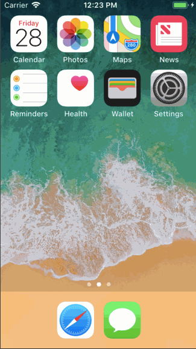
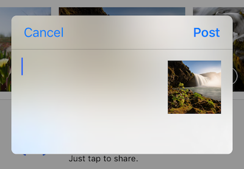
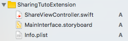
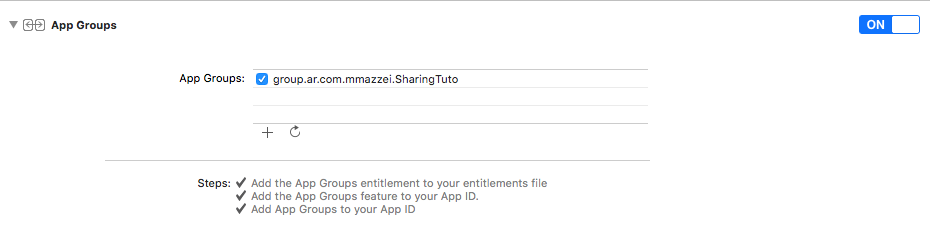
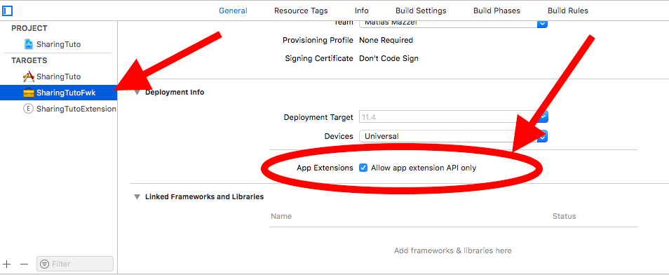
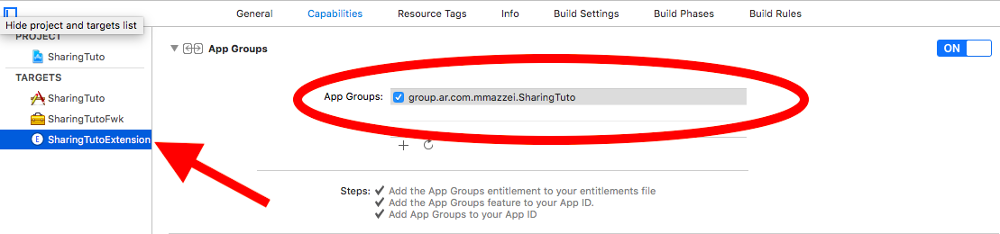
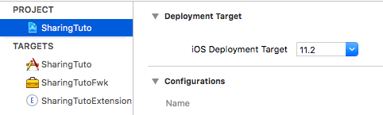

# Cómo implementar una Share Extension en iOS 11

<p align="left">
<a href="https://swift.org"></a>
<a href="https://developer.apple.com"></a>
</p>


> An app extension is not an app. It implements a specific, well scoped task that adheres to the policies defined by a particular extension point.

  * [Objetivos](#objetivos)
  * [Paso 1: Crear el target](#paso-1-crear-el-target)
  * [Paso 2: Configurar la UI](#paso-2-configurar-la-ui)
  * [Paso 3: Compartiendo información entre app y extensión](#paso-3-compartiendo-información-entre-app-y-extensión)
  * [Paso 4: Compartiendo código entre app y extensión](#paso-4-compartiendo-código-entre-app-y-extensión)
  * [Paso 5: Llamadas a la API REST desde la extensión](#paso-5-llamadas-a-la-api-rest-desde-la-extensión)
  * [Paso 6: Subir imágenes desde la extensión](#paso-6-subir-imágenes-desde-la-extensión)
  * [Paso 7: Habilitar la extensión sólo para cierto tipo de contenido](#paso-7-habilitar-la-extensión-sólo-para-cierto-tipo-de-contenido)
  * [Notas](#notas-1)
  * [Referencias](#referencias)
  * [Comentarios](#comentarios)

## Objetivos



El objetivo de este tutorial es mostrar paso a paso cómo implementar una "Sharing Extension" en una app.

El ejemplo que aquí se desarrolla consiste en una extensión que permite elegir una imagen, asignarla a uno de los álbumes del usuario en [imgur](imgur.com), con algún título y compartirla, iniciando el proceso en segundo plano.

A lo largo del tutorial se hace referencia a distintos commits para que pueda verse la evolución del proyecto y comprenderse mejor qué es necesario en cada etapa.


## Paso 1: Crear el target

Una extensión es un programa que permite ejecutar una tarea en un contexto bien definido. Y se instala junto con la aplicación, cuando el usuario la descarga desde el App Store.

Es por ello que necesitamos agregar un nuevo target a la app para crear la extensión. Esto es una tarea muy simple ya que Xcode nos provee algunos templates que ya son funcionales sin necesidad de cambios.

 1. `File -> New -> Target`
 2. Seleccionar la opción "Share Extension"
 3. Completar los datos
 4. Finish

Si ejecutamos la aplicación en este punto, podemos comprobar que la extensión funciona abriendo la app Fotos, seleccionando cualquier foto y tocando el botón de "Compartir".

## Paso 2: Configurar la UI

La versión inicial, sin modificar el código generado por Xcode, se ve así:



Y estos son los archivos generados:



Para implementar la UI podemos proveer nuestro propio `UIViewController` o simplemente utilizar un `SLComposeServiceViewController`. Esto último es lo que haremos en este tutorial, decantándonos siempre por la opción más simple.

El `SLComposeServiceViewController`, nos pide implementar, al menos, tres métodos:

 * `isContentValid() -> Bool`: Si devolvemos `true`, el botón "Post" se activa, y si devolvemos `false`, se desactiva. Aquí podemos validar que el usuario haya ingresado un título, seleccionado algunas opciones, etc. Este método es invocado cada vez que el usuario edita el título o cuando invocamos `validateContent()` en el `ViewController`.
 * `didSelectPost()`: Cuando el usuario está conforme con el contenido y decide compartirlo, toca el botón "Post" y este método es invocado. Todo lo que tenemos que hacer aquí es iniciar la tarea de upload en segundo plano y notificar a la aplicación anfitrión ("host app"), que la tarea se ha completado y puede finalizarse la extensión, eso puede hacerse con `super.didSelectPost()`.
 * `configurationItems() -> [Any]!`: Aquí indicamos los ítems adicionales a mostrar en el formulario. Cada uno se muestra como una fila con un título y un valor. La idea es que el usuario toque la fila y se le presente otro `ViewController` donde selecciona algún valor, ya que todas estas filas tienen un `>` que no puede quitarse.

En nuestro ejemplo queremos subir una imagen a un álbum en [imgur](https://imgur.com), proveyendo de un texto descriptivo de más de 3 caracteres de longitud.

Para lograr esto es suficiente con un `UITableViewController` que muestre la lista de álbumes del usuario y permita seleccionar uno. La clase `ChooseAlbumViewController` es la que implementa este comportamiento.

### Commits 

ℹ️ `git checkout de67b94` para explorar la versión inicial, que muestra una lista _mockeada_ de 5 álbumes con lo expuesto hasta ahora.

ℹ️ `git checkout 485c310` para la versión que permite explorar los álbumes del usuario en imgur y  añadir imagenes en background, con la limitación de que sean de a una por vez.


## Paso 3: Compartiendo información entre app y extensión

Si queremos ser capaces de obtener los álbumes del usuario desde la extensión, entonces necesitaremos acceder al auth token que se obtiene al loguearse desde la aplicación.

En el `LogInViewController` vemos que este token se guarda, junto con algo más de información, de esta manera:

```
func webView(_ webView: WKWebView, didReceiveServerRedirectForProvisionalNavigation navigation: WKNavigation!) {
    guard let url = webView.url else { return }

    Environment.credentials = parseCredentials(in: url)
    delegate?.logInViewControllerDidFinish(self)
}
```

Y, en el _setter_ de `Environment.credentials`, se termina escribiendo en `UserDefaults.standard`:

```
let credentialsData = try? PropertyListEncoder().encode(newValue)
UserDefaults.standard.set(credentialsData, forKey: credentialsKey)
```

Lo que debemos hacer es que, en lugar de en `UserDefaults.standard`, se almacene esta información en un `UserDefaults` compartido. Para ello, la documentación de Apple, dice lo siguiente:

>After you enable app groups, an app extension and its containing app can both use the NSUserDefaults API to share access to user preferences. To enable this sharing, use the initWithSuiteName: method to instantiate a new NSUserDefaults object, passing in the identifier of the shared group

Por lo tanto, debemos habilitar la _App Groups Capability_ en el proyecto y crear un identificador del grupo.



### Commits 

ℹ️ `git checkout 9a290ef`


## Paso 4: Compartiendo código entre app y extensión

Para compartir el código en común entre la aplicación y la extensión sólo hay que seguir nuevamente lo indicado en la documentación de Apple:

> You can create an embedded framework to share code between your app extension and its containing app.

 1. `File -> New Target`
 2. Seleccionar la opción "Cocoa Touch Framework"
 3. ...
 4. Profit

Tenemos que asegurarnos de que el framework sólo utiliza APIs disponibles para extensiones, para ello tildamos la opción "Allow app extension API only" en el target



Una vez creado, movemos al framework el código compartido. En nuestro caso son los archivos dentro de los grupos `APIClient` y `Model` y `Environment.swift`.

### Notas

⚠️ En la versión `9.4.1 (9F2000)` de Xcode, tuve problemas moviéndolos de un target a otro dentro del IDE. La mejor forma que encontré de hacerlo sin errores fue:

 1. Dentro de Xcode elegir los archivos a mover y eliminarlos (en nuestro caso los dos grupos y `Environment`). Cuando se pregunte qué hacer con ellos en el popup de confirmación, elegir `Remove Reference`.
 2. Buscar en Finder los directorios correspondientes.
 3. Moverlos en Finder a sus nuevas ubicaciones (dentro del directorio del framework)
 4. Drag & Drop de los nuevos directorios y `Environment.swift` a Xcode, dentro del framework.

Además de eso, son necesarios cambios en el código fuente:

 * En cada archivo Swift que se utilice alguna de estas clases que ahora están en el framework, hay que agregar `import SharingTutoFwk`.
 * Cada tipo, método o propiedad que sea utilizado fuera del framework debe tener visibilidad `public `.

### Commits 

ℹ️ `git checkout 2e1e368`


## Paso 5: Llamadas a la API REST desde la extensión

Ahora que compartimos desde la app las credenciales del usuario y el código que utilizamos para llamar a la API, ya podemos reemplazar en `ChooseAlbumViewController` la lista mockeada por la actual.

Para poder acceder a los `UserDefaults` compartidos desde la extensión, tenemos que habilitar el `App Groups Capabilities` del mismo modo que lo hicimos en la aplicación, agregando este target al grupo.



### Commits 

ℹ️ `git checkout 502aa70`


## Paso 6: Subir imágenes desde la extensión

Dependiendo de la configuración de la extensión, el ítem que el usuario haya seleccionado para compartir puede ser de distintos tipos: una imagen, un video, una página web, un fragmento de texto,... y puede también ser más de uno (más adelante se explica cómo restringir todo esto). Es por ello que, para acceder al contenido de este ítem, hay que filtrar primero entre todos los disponibles en el contexto.

El sistema operativo envía un `NSExtensionContext` al `ViewController` inicial al ejecutar la extensión. En este objeto se encuentra, justamente, información del contexto.

Suponiendo que sólo nos interesa un ítem, y que éste debe ser una imagen, este es el modo de obtenerlo:

```
private static func imageAttachment(from context: NSExtensionContext) -> NSItemProvider? {
    guard let media = context.inputItems.first as? NSExtensionItem else { return nil}
    guard let attachments = media.attachments as? [NSItemProvider] else { return nil }

    for attachment in attachments {
        if attachment.hasItemConformingToTypeIdentifier(kUTTypeImage) {
            return attachment
        }
    }
    return nil
}
```

Y, para acceder al contenido de dicho ítem (el `Data`):

```
let imageAttachment = imageAttachment(from: context)
imageAttachment?.loadItem(forTypeIdentifier: kUTTypeImage, options: nil) { (item, error) in
    // ...
}
```

Donde el parámetro `item` enviado al contexto es la `URL` de la foto.

Todo esto puede verse implementado en `NSExtensionContext+SharingTuto.swift`.

En esta demo siempre subimos la imagen como `jpeg`, por lo tanto no hace falta más información ni detalle sobre la imagen, simplemente cargamos la imagen de la URL provista y la convertimos en `jpeg`.

⚠️ Debe tenerse en cuenta que el sistema operativo _puede_ terminar la extensión mientras el archivo se está subiendo en segundo plano y luego iniciar la app para notificarle que ya ha terminado (o que ha ocurrido algún error).

⚠️ La app y la extensión no tienen acceso a los directorios una de la otra. Es por ello que el archivo a subir necesita estar en una ubicación disponible tanto a la app como a la extensión.

⚠️ Además no debe olvidarse configurar el `sharedContainerIdentifier` de la sesión al momento de crearla. De otro modo, el sistema operativo la invalidará automáticamente en la extensión si se trata de hacer un upload en segundo plano.

### Notas

 - Se agregó un método `start` al `BackgroundSession`, para poder reiniciarlo entre dos sucesivas ejecuciones de la extensión ya que parece ser que las instancias de singletons quedan cargadas en memoria en la `hosting application`, reutilizándose al ejecutar la extensión de vuelta. Debe invocarse este método también cuando se lanza la aplicación, desde el `UIApplicationDelegate`.
 - Si en la extensión se muestra un mensaje de error en un `UIAlertController`, no debe olvidarse invocar el método `completeRequest` al cerrar este diálogo. Si se invoca `completeRequest` antes, entonces el usuario no podrá ver el mensaje ya que iOS finaliza la extensión. Por ello es que se lo hace en el `callback` del botón "OK".
 - La extensión no tiene permiso para acceder al directorio indicado por `FileManager.default.containerURL:forSecurityApplicationGroupIdentifier:`, por lo que debemos asegurar de agregar `Library/Cache` al final del path, como hemos hecho en la variable `Environment.sharedContainerUrl`.

### Commits 

ℹ️ `git checkout 3f92039`


## Paso 7: Habilitar la extensión sólo para cierto tipo de contenido

Como esta extensión está pensada para subir una imagen a imgur, entonces debemos evitar que el sistema operativo la muestre en el diálogo de compartir para otro tipo de contenido (video, webs, audio...). Esto se especifica en el archivo `plist` de la extensión, dejando el valor de `NSExtensionAttributes` como sigue:

```
    <key>NSExtensionAttributes</key>
    <dict>
        <key>NSExtensionActivationRule</key>
        <dict>
            <key>NSExtensionActivationSupportsImageWithMaxCount</key>
            <integer>1</integer>
        </dict>
    </dict>
```

Para más opciones puede visitarse la [documentación de Apple al respecto](https://developer.apple.com/library/archive/documentation/General/Reference/InfoPlistKeyReference/Articles/AppExtensionKeys.html).

# Notas

 - Debe verificarse que todos los targets tengan el mismo `iOS Deployment Target`. Por lo tanto es mejor evitar configurarlo en cada target y hacerlo en el proyecto. 
 

 
 - Si se utilizan Cococapods en la extensión, debemos especificar este target en el `Podfile`:

```
platform :ios, '10.0'
use_frameworks!

target 'SharingTuto' do
  # pods for the app
  pod 'SomeNicePod'
end

target 'SharingTutoFwk' do
  # pods for the shared fwk
end

target 'SharingTutoExtension' do
  # pods for the extension
end
```
 - Para que la app sea aceptada por Apple para la App Store, debe utilizarse el mismo número de versión en todos los targets (app, framework, extensión).


## Referencias
 - [Sharing and Actions](https://developer.apple.com/design/human-interface-guidelines/ios/extensions/sharing-and-actions/)
 - [App Extension Essentials](https://developer.apple.com/library/archive/documentation/General/Conceptual/ExtensibilityPG/index.html#//apple_ref/doc/uid/TP40014214-CH20-SW1)
 - [Creating an App Extension](https://developer.apple.com/library/archive/documentation/General/Conceptual/ExtensibilityPG/ExtensionCreation.html#//apple_ref/doc/uid/TP40014214-CH5-SW1)
 - [Networking in a Short-Lived Extension](https://forums.developer.apple.com/thread/76659)

## Comentarios
¿Algo de lo que escribí está mal? ¿Algo de lo que escribí puede mejorarse? ¿Se te ocurren mejores ejemplos? ¿Tenés ganas de insultar a alguien? ¿No te anda el “CTRL+C”? ¿Sentís que estás sólo en el universo?

Podés escribir un comentario y presionar el botón invisible de “Enviar comentario” aquí abajo, o buscar en el sitio, que en algún lugar están mis datos de contacto. No me acuerdo bien dónde.
